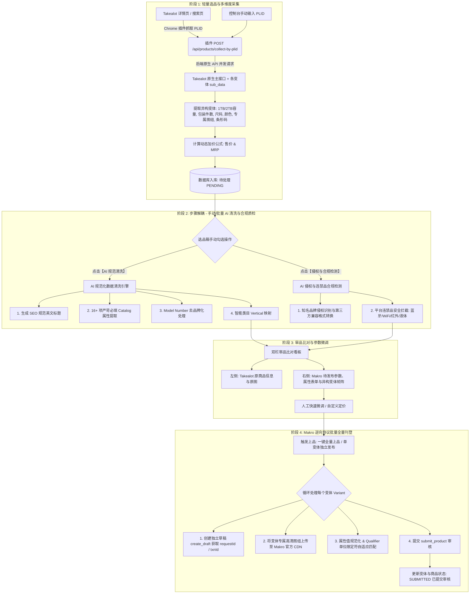

# Makro-Takealot 智能搬品与多变体自动化刊登系统

基于南非电商平台 **Takealot** 官方原生 API 采集、**AI（通义千问 / DeepSeek）** 规范化数据清洗与合规风控、以及逆向破解的 **Makro（基于 Flipkart SaaS 引擎）** 底层协议所构建的一体化跨境电商智能搬品刊登系统。

---

## 一、系统整体功能流程图



---

## 二、核心模块与技术特性

### 1. 极简轻量 Chrome 插件 (`extension/`)
- **轻量 PLID 转发模式**：彻底移除前端页面重 DOM 抓取与反爬代码，仅负责在 Takealot 详情页从 URL、Canonical、LD-JSON 及 DOM 属性中提取 `PLID` 并投递给中台后端。
- **Makro 凭据一键同步**：访问 `seller.makro.co.za` 时，一键将当前浏览器的 `fk-csrf-token`、Session Cookie 与 `sellerId` 自动同步至本地中台，彻底免除手动抓包复制。

### 2. Takealot 官方原生 API 并发采集 (`takealot_service.py`)
- **原生接口高速爬取**：调用 Takealot 官方原生 REST API 并发抓取主商品及所有变体子接口（`sub_data`）。
- **多变体异构参数深度提取**：精准提取 **容量/内存（1000GB/1TB/2TB/512GB）**、**包装件数（60Pack/120Pack）**、**尺码**、**颜色**、**变体专属标题**、**条形码 (Barcode)** 与 **变体独立图组**，杜绝参数丢失与默认均码退化。

### 3. AI 清洗与合规质检解耦流水线 (`ai_cleaner_service.py` & `compliance_service.py`)
- **步骤解耦**：采集后不自动强制清洗，由用户在选品箱根据需要手动单选或批量勾选执行清洗/合规检测。
- **品牌配件防侵权**：对于 Apple、Samsung、Dyson 等大牌兼容配件，强制重塑为合规的第三方兼容格式（`Third-Party ... Compatible with ...`），避免平台判定为品牌冒充侵权。
- **Model Number 规范化**：自动剔除属性值中的品牌名（Brand Name），严格满足 Makro CMS `Brand name should not be part of model_number` 校验规则。
- **违禁品安全拦截**：自动识别并标记蓝牙、WiFi、红外线、液体等受限商品，禁止直接上架以保障店铺安全。

### 4. Makro 逆向协议驱动与全量变体上架 (`makro.py` & `makro_client.py`)
- **全量多变体批量上架**：循环为商品下的每一个变体创建独立草稿、上传变体专属图组至 Makro CDN，映射专属 SKU、售价及销售属性。
- **单变体独立发布与重试**：支持在变体矩阵中对特定变体单独上传上架 (`POST /api/makro/publish-variant/{variant_id}`)。
- **属性与单位限定符 (Qualifier) 自适应适配**：自动识别 `GB/TB`、`cm`、`g/kg`、`Mbps` 等单位限定符，并对齐官方 `allowedValues` 枚举。

---

## 三、快速上手指南

### 第一步：启动本地中台系统
在项目根目录下双击 **`启动系统.bat`**（或在终端运行）：
```bash
python start_system.py
```
- **控制台地址**：`http://localhost:8001`
- **API 接口文档**：`http://localhost:8001/api/docs`

---

### 第二步：加载 Chrome 浏览器插件
1. 打开 Chrome 浏览器，访问 `chrome://extensions/` 并开启右上角 **【开发者模式】**。
2. 点击左上角 **【加载已解压的扩展程序】**，选择本项目中的 **`extension`** 目录。

---

### 第三步：同步 Makro 店铺凭据
1. 访问并登录 [Makro 卖家中心](https://seller.makro.co.za/)。
2. 点击页面浮动的 **【🔄 同步登录态至后台】** 按钮即可完成授权。

---

### 第四步：选品、清洗与刊登上架
1. 在 [Takealot.com](https://www.takealot.com/) 商品页点击右下角 **【📦 一键采集到 Makro】**（或在控制台直接输入 PLID 采集）。
2. 打开控制台 `http://localhost:8001`：
   - **选品箱**：勾选商品，点击 **【AI 规范清洗】** 或 **【侵权/违禁合规检测】**；
   - **审品比对**：查看左右两侧参数对齐情况与变体矩阵；
   - **刊登上架**：点击 **【🚀 立即上品到 Makro】**，系统自动转存图片并提交 Makro 卖家中心审核。

---

## 四、系统架构目录

```tree
makro-takealot-uploader/
├── backend/                  # FastAPI 后端服务
│   ├── app/
│   │   ├── api/              # 商品管理、AI 清洗、Makro 上品、系统配置、任务日志
│   │   ├── core/
│   │   ├── models/           # SQLAlchemy 数据模型 (Product, ProductVariant, TaskLog, SystemSetting)
│   │   ├── schemas/          # Pydantic 校验与响应模型
│   │   ├── services/         # 核心引擎: takealot_service, makro_client, ai_cleaner, compliance, pricing
│   │   └── templates/        # 现代化 Web 控制台 (Vue 3 + Tailwind CSS)
│   ├── tests/                # 自动化测试脚本
│   └── main.py               # FastAPI 服务入口
│
├── extension/                # Chrome 选品辅助插件 (Manifest V3 - 轻量转发模式)
│   ├── manifest.json
│   ├── popup/                # 插件弹窗控制面板
│   └── scripts/
│       ├── content_takealot.js # Takealot 页面 PLID 提取注入脚本
│       ├── content_makro.js    # Makro 凭据同步注入脚本
│       └── background.js       # 通信与后端转发服务
│
├── start_system.py           # 一键启动脚本
├── 启动系统.bat               # Windows 双击启动入口
└── README.md                 # 完整系统技术文档
```

