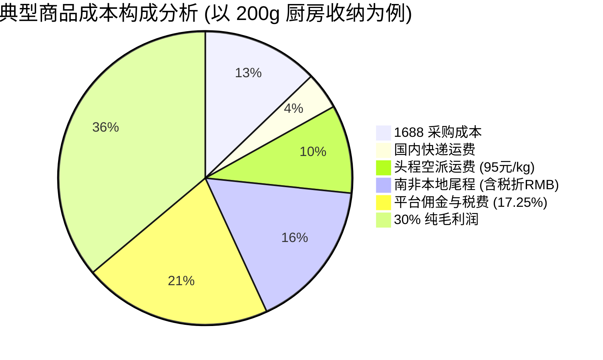

# 1688 采购与全链路成本定价核算手册 (Makro 专属版)

> **版本**：v2.0 (全参数闭环与精准税费精算版)  
> **适用对象**：跨境选品运营、财务核算、1688 采购开发、中台系统配置人员  
> **核心宗旨**：**算清每一分钱，杜绝隐性亏损，确保每一单稳收 30% 毛利！**

---

## 一、全链路成本与平台费用基准参数表

本核算模型基于您实际运营中确定的关键参数及南非当地税法构建：

| 参数项 | 基准数值 / 设定值 | 单位 | 说明与计算备注 |
| :--- | :---: | :---: | :--- |
| **采购成本 ($P_{1688}$)** | 依款式而定 | RMB (元) | 1688 源头工厂批量采购批发单价。 |
| **国内运费 ($F_{dom}$)** | $\le 10$ 元（默认取 $8$ 元） | RMB (元) | 1688 发往国内集货/打单转运仓运费（若单品包邮则记为 0）。 |
| **头程国际单价 ($U_{first}$)** | **95** | RMB/kg | 中国发往南非空派/空运专线普货单价。 |
| **材积换算基数 ($V_{base}$)** | **6000** | $\text{cm}^3/\text{kg}$ | 国际快递标准材积系数：$L(\text{cm}) \times W(\text{cm}) \times H(\text{cm}) / 6000$。 |
| **南非尾程派送基数** | **70** | ZAR (兰特) | 南非当地第三方物流（如 The Courier Guy 等）安全默认配送基础费。 |
| **尾程派送税费 (VAT)** | **15%** | 百分比 | 南非本土物流服务强制缴纳 15% 增值税。 |
| **尾程实际含税运费 ($F_{last}$)** | **80.5** | ZAR (兰特) | $70 \times (1 + 15\%) = 80.50 \text{ ZAR}$。 |
| **参考结算汇率 ($Rate$)** | **0.40** | CNY/ZAR | **1 ZAR = 0.40 RMB**（即 1 RMB = 2.50 ZAR）。 |
| **尾程折合人民币** | **32.20** | RMB (元) | $80.50 \times 0.40 = 32.20 \text{ 元}$。 |
| **Makro 平台佣金率** | **15%** | 百分比 | 平台基础类目最高佣金比例。 |
| **佣金附加税费 (VAT)** | **15%** | 百分比 | 平台向卖家收取的佣金需征收 15% 南非增值税。 |
| **平台综合扣费率 ($R_{fee}$)** | **17.25%** | 百分比 | $15\% \times (1 + 15\%) = 17.25\%$（平台实扣比例）。 |
| **目标毛利率 ($Margin$)** | **30%** | 百分比 | 净毛利润占最终售价的比例：$(\text{回款} - \text{总成本}) / \text{售价} = 30\%$。 |

---

## 二、全链路成本与精准定价推导公式

### 1. 头程计费重量定义 ($W_{chargeable}$)
物流商以实际重量和体积重量两者取最大值计费：
$$\text{体积重量 } W_{vol} = \frac{L(\text{cm}) \times W(\text{cm}) \times H(\text{cm})}{6000} \quad (\text{单位: kg})$$
$$\text{计费重量 } W_{chargeable} = \max(\text{实际毛重 } W_{act}, W_{vol})$$
$$\text{头程运费 (RMB) } F_{first} = W_{chargeable} \times 95$$

---

### 2. 商品落地总成本计算 ($\text{Cost}_{total}$)
**【人民币总成本】**：
$$\text{Cost}_{total (CNY)} = P_{1688} + F_{dom} + (W_{chargeable} \times 95) + 32.20$$

**【兰特总成本】**（折算到南非本地）：
$$\text{Cost}_{total (ZAR)} = \frac{\text{Cost}_{total (CNY)}}{0.40} = \frac{P_{1688} + F_{dom} + (W_{chargeable} \times 95)}{0.40} + 80.50$$

---

### 3. Makro 最终兰特售价反推公式 ($Price_{ZAR}$)
平台回款与毛利率关系：
$$\text{卖家实际回款} = Price_{ZAR} \times (1 - 17.25\%) = Price_{ZAR} \times 82.75\%$$
$$\text{目标毛利 (30\%)} = Price_{ZAR} \times 30\%$$
由此可知，留给总成本的比例为：
$$82.75\% - 30\% = 52.75\% = 0.5275$$

因此，**最终兰特销售价的严密数学公式**为：
$$\bbox[10px,border:2px solid #2563eb,background:#f0f7ff]{Price_{ZAR} = \frac{\text{Cost}_{total (ZAR)}}{0.5275} = \frac{\text{Cost}_{total (CNY)}}{0.40 \times 0.5275} = \frac{\text{Cost}_{total (CNY)}}{0.211}}$$

> 🔥 **黄金极速换算乘数**：
> $$\text{Makro 售价 (ZAR)} \approx \text{人民币总成本} \times 4.7393$$
> **即：每发生 1 元人民币的综合采购与运费落地成本，在 Makro 需定价约 4.74 兰特，才能严丝合缝达到 30% 纯毛利率！**

---

### 4. Makro 划线原价 (MRP) 制定规范
Makro 平台前台展示遵循南非电商消费心理：
1. **整数要求**：Makro 接口只接收正整数（`POSITIVE_INTEGER`），计算出来的售价向上取整。
2. **心理定价法**：建议尾数以 `9` 或 `99` 结尾，提升点击转化率（例如 186 兰特取整至 189 或 199 兰特）。
3. **MRP 划线原价**：
   $$\text{MRP} = \text{round}(Price_{ZAR} \times 1.5) \quad (\text{通常取 1.4 ~ 1.6 倍，并调优至如 299, 399, 499 兰特})$$

---

## 三、典型商品实战测算与盈亏案例库

通过对比 3 种典型商品（轻小配件、中型日用百货、轻泡大件），直观掌握不同产品特性的利润与定价表现：



### 实战测算数据对照表

| 对比项目 | 案例 A：数码/相机小配件 | 案例 B：厨房收纳小工具 | 案例 C：轻泡大件（如大号收纳桶） |
| :--- | :---: | :---: | :---: |
| **实物尺寸 (cm)** | $8 \times 8 \times 3$ | $15 \times 12 \times 8$ | $30 \times 25 \times 20$ |
| **实际毛重 ($W_{act}$)** | 0.05 kg (50g) | 0.20 kg (200g) | 0.45 kg (450g) |
| **材积重量 ($V/6000$)** | 0.032 kg | 0.24 kg | **2.50 kg** (严重超标!) |
| **计费重量 ($W_{chg}$)** | **0.05 kg** (取实重) | **0.24 kg** (取材积) | **2.50 kg** (取材积) |
| **1688 采购价** | 8.00 元 | 25.00 元 | 28.00 元 |
| **国内寄送运费** | 6.00 元 | 8.00 元 | 8.00 元 |
| **头程运费 (95元/kg)** | $0.05 \times 95 = 4.75$ 元 | $0.24 \times 95 = 22.80$ 元 | $2.50 \times 95 = \mathbf{237.50}$ 元 |
| **南非尾程 (含税折RMB)** | 32.20 元 | 32.20 元 | 32.20 元 |
| **人民币总成本** | **50.95 元** | **88.00 元** | **305.70 元** |
| **兰特总成本** | 127.38 ZAR | 220.00 ZAR | 764.25 ZAR |
| **目标售价 (30%毛利)** | **242 ZAR** | **418 ZAR** | **1450 ZAR** |
| **划线原价 (MRP 1.5倍)** | 369 ZAR | 629 ZAR | 2199 ZAR |
| **平台实收佣金+税** | 41.7 ZAR | 72.1 ZAR | 250.1 ZAR |
| **实际净毛利 (30%)** | **72.6 ZAR (约 29 元)** | **125.4 ZAR (约 50 元)** | **435.0 ZAR (约 174 元)** |
| **选品判定结果** | 🟢 **推荐选品**<br>成本低、轻便、出单快 | 🟢 **主力选品**<br>利润丰厚、退货率低 | 🔴 **坚决淘汰！**<br>泡重高达2.5kg，售价需达1450兰特，无市场竞争力！ |

---

## 四、选品生死红线：三大亏损陷阱警示

选品人员必须牢记以下三大“隐性杀手”，避免踩坑：

### 陷阱 1：大体积“轻泡货”陷阱（空运大忌）
* **现象**：1688 上一个塑料大收纳盒只要 15 块钱，看起来很便宜，拿起来只有 300 克。
* **致命痛点**：尺寸 $35 \times 25 \times 20\text{ cm}$，体积重高达 $2.92\text{ kg}$！
* **后果**：光头程运费就要 $2.92 \times 95 = 277$ 元人民币！一个 15 块钱的东西总成本变成了 330 多元，在 Makro 上必须卖 1500 多兰特，根本卖不出去；一旦盲目低价销售，**卖一个倒亏 200 块**！
* ⚠️ **选品准则**：**材积重量超过 0.8 kg 的无附加值大件，严禁作为小包直发模式开发！**

### 陷阱 2：超低客单价商品的“尾程吞噬”陷阱
* **现象**：1688 上 1 块钱的手机支架、3 块钱的钥匙扣。
* **致命痛点**：南非本土尾程快递不管多小的件，起步就是 70 兰特 + 15% 税 = **80.5 兰特（折合 32.2 元人民币）**。
* **后果**：哪怕采购和头程只要 5 块钱，加上国内运费和尾程，落地成本也要接近 45 元人民币，最终定价需在 219 兰特以上。对于一个 1 块钱的小塑料片，消费者心理预期只有 30~50 兰特，极易造成滞销。
* ⚠️ **选品准则**：**建议单品 1688 采购价在 15~60 元人民币之间，既能摊薄尾程固定运费，又具备足够的品质与价格韧性；或者将超低价小件打包为 3件套/5件套（Multi-pack）销售！**

### 陷阱 3：平台佣金与税费的“复利低估”
* 很多人算账时只按 15% 算佣金，忽略了南非税务局对服务征收的 15% VAT（增值税）。
* 实际平台抽成是 $15\% \times 1.15 = 17.25\%$。如果在公式中漏掉这 $2.25\%$，当月销售 10 万兰特就会莫名其妙产生 **2250 兰特（近 1000 元人民币）的账面亏空**！本手册公式已严密内置该税费。

---

## 五、1688 选品与定价快速自查卡

```
┌────────────────────────────────────────────────────────────┐
│                  1688 选品 30 秒定价自查口诀               │
├────────────────────────────────────────────────────────────┤
│ 1. 查体积： 长 × 宽 × 高 ÷ 6000，是否严重大于实际毛重？     │
│ 2. 算总成： 采购价 + 8元国内 + (计费重×95) + 32.2元尾程     │
│ 3. 翻售价： 人民币总成本 × 4.74 = Makro 兰特底线售价        │
│ 4. 瞄竞品： 该售价在 Makro / Takealot 上是否有价格优势？   │
│ 5. 定划线： 最终售价 × 1.5 = MRP 原价 (整数以 9 结尾)       │
└────────────────────────────────────────────────────────────┘
```
