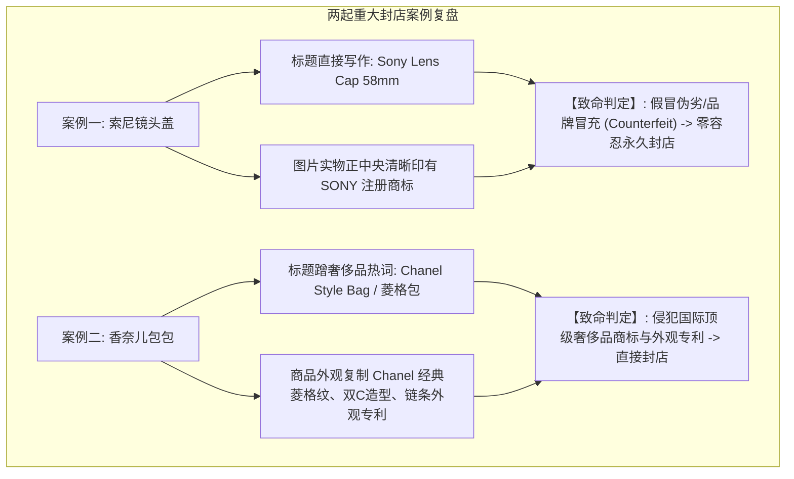
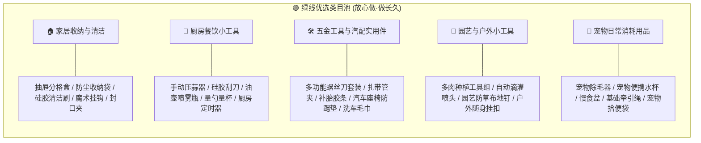
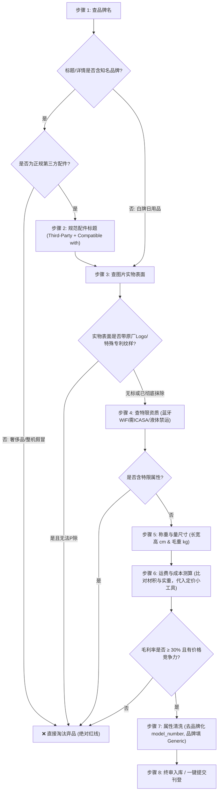

# Makro 选品与防侵权合规实操手册

> **版本**：v2.0 (全链路合规与封店风控升级版)  
> **适用对象**：选品开发人员、商品运营人员、刊登审核人员、1688采购人员  
> **核心宗旨**：**安全第一，合规为本，杜绝侵权，稳健盈利**。严防任何可能导致 Makro 店铺受限、罚款或永久封店的高危行为。

---

## 一、血泪教训复盘与平台封店机制深度剖析

近期因知识产权（IPR）侵权问题，两家 Makro 店铺被平台永久封禁，冻结资金并下架全店商品。通过对平台封店通知及涉事商品的深度复盘，必须深刻认识到 Makro 平台的合规监管机制：

### 1. 为什么“配件”也会导致直接封店？
* **痛点误区**：“我卖的只是几块钱的副厂配件，又不是相机主机，怎么就算假冒了？”
* **平台定性**：
  1. **标题原厂混淆**：标题直接出现品牌词作主语（如 `Sony Lens Cap`），买家和平台算法会直接认定你在售卖索尼官方正品，若无品牌授权即为“虚假陈述与假冒”。
  2. **图片带有原厂商标（最致命死穴）**：1688 上很多仿制配件为了迎合线下市场，镜头盖、电池盖上私自刻印了原厂 Logo（如 SONY、CANON、NIKON）。**只要产品图片或实物带有他人注册商标，无论标题怎么写，在法律上即构成销售假冒注册商标商品罪/侵权行为，平台一票否决必死无疑！**

### 2. 为什么“奢侈品与知名品牌”碰都不能碰？
* 国际一线奢侈品牌（Chanel、LV、Gucci、Dior、Hermes、Rolex 等）在全网均部署了专属知识产权维权系统（Brand Protection / VERO）。
* 奢侈品的维权不仅限于“文字商标”，还涵盖了**外观设计专利、立体商标、经典图案**（如香奈儿菱格纹与双C扣、LV老花Monogram、Gucci红绿条纹等）。哪怕商品没有任何字母，只要包包外形高度相似，平台人工巡检一眼即判定封店！

---

## 二、Makro 选品三级风控红黄绿线矩阵

所有进入选品池的商品，必须在初选阶段严格按照以下三级矩阵进行分类定级：

| 风控等级 | 池别定义 | 代表品类 / 商品 | 上架准入规则 |
| :---: | :---: | :--- | :--- |
| 🔴 **红线池** | **绝对禁售** （碰了直接封店） | • 国际一线奢侈品箱包、服饰、鞋、手表 • 实物印有原厂Logo的假冒商品 • 知名影视/动漫/游戏受保护IP周边 • 蓝牙/WiFi等无线需认证设备、液体纯电 | **系统一律拦截，人工严禁开发！** 任何人员不得以任何理由上架该类商品。 |
| 🟡 **黄线池** | **严格受控** （第三方兼容配件） | • 相机镜头盖/遮光罩/转接环/相机包 • 替换吸尘器滤网/刷头/尘袋 • 智能手表第三方表带/保护壳 • 游戏手柄摇杆帽/防尘罩/保护壳 | **严格符合规范才准上架：** 1. 标题必须有 `Third-Party` 及 `Compatible with` 2. 图片表面绝对不能有任何品牌Logo 3. 属性 model_number 剔除品牌词 |
| 🟢 **绿线池** | **安全畅销** （推荐重点深耕） | • 家居收纳日用品、厨房小工具、卫浴置物 • 通用五金工具、园艺花盆、扎带、喷头 • 通用非品牌办公文具、无标数码理线器 • 通用宠物梳毛刷、逗猫玩具、拾便袋 | **优先批量开发，自动化全速上架！** 1688源头厂家直供，无品牌专利纠纷，抗风险能力最强。 |

---

## 三、第三方兼容配件类（黄线池）合规刊登铁律

如果选择开发兼容配件类（如相机周边、家电替换件、手表表带等），必须**同时满足以下四大军规**，缺一不可：

### 军规 1：标题强制采用“第三方兼容”标准结构
严禁将品牌名置于标题首位！必须明确告知消费者这是**第三方副厂生产的兼容配件**。

> 📌 **标准标题命名公式**：  
> `Third-Party + [配件核心品类词] + Compatible with / Suitable for / Replacement for + [适配品牌及具体型号] + [材质/尺寸/颜色]`

#### 正确 vs 错误范例对照表
| 品类 | ❌ 违规致命写法（必封） | ✅ 合规标准写法（安全） |
| :--- | :--- | :--- |
| **相机镜头盖** | `Sony Alpha A7 Lens Cap 58mm Protective Cover` | `Third-Party Camera Lens Front Protective Cap Compatible with Sony Alpha 7 / A7M4 (58mm)` |
| **吸尘器耗材** | `Dyson V10 Cordless Vacuum Cleaner Replacement Filter` | `Replacement Washable HEPA Filter Compatible with Dyson V10 SV12 Series Vacuum Cleaners` |
| **手表表带** | `Apple Watch Ultra 49mm Titanium Metal Strap Band` | `Third-Party Stainless Steel Metal Watch Band Compatible with Apple Watch Ultra 1/2 49mm` |
| **游戏手柄配件** | `PS5 Controller Silicone Protective Case Cover` | `Silicone Anti-Slip Controller Grip Protective Cover Compatible with PS5 / PlayStation 5 Gamepad` |
| **电动牙刷头** | `Philips Sonicare Electric Toothbrush Replacement Heads` | `Replacement Electric Toothbrush Brush Heads Compatible with Philips Sonicare DiamondClean Series` |

### 军规 2：商品主图与详情图的“绝对无标（No-Logo）”红线
1. **实物表面无标**：
   - 采购时必须向 1688 供应商确认：实物产品表面为**中性白牌，不得有原厂字母标、符号标或浮雕暗纹**。
   - 拿货样图如果带标，必须由美工**使用 PS 将 Logo 彻底抹平涂掉**，做到不留一丝痕迹。若无法无痕抹除，直接弃品！
2. **严禁盗用原厂宣传素材**：
   - 不得使用 Sony、Apple、Dyson 等官方网站的原厂渲染图、白底爆炸图或代言人海报。
   - 必须使用纯白底白牌产品摄影图，或生活场景实拍图。
3. **主图搭配示范**：
   - 若展示配件装配在主机上的效果图，主机必须虚化或注明“主机仅做展示使用，本品不包含相机/主机”。

### 军规 3：Catalog 属性填报去品牌化
在 Makro 后台或中台系统录入商品属性时：
- **Brand Name（品牌）**：一律填写店铺注册白牌名，或平台允许的中性词 `Generic`，**绝对不能填写 Sony、Apple、Chanel 等原厂名**！
- **Model Number（型号）**：必须去除品牌词。例如原厂型号为 `Sony ALC-F58S`，合规录入为 `LC-58MM-BK`，绝对满足 Makro CMS `Brand name should not be part of model_number` 审核规则。

---

## 四、绝对禁止与限制品类明细库（红线池）

选品人员在 1688 检索筛选商品时，遇到以下关键词与品类直接跳过：

### 1. 国际知名奢侈品牌与高危时尚品牌（严禁任何箱包/服饰/鞋/配饰）
* **箱包配饰类**：Chanel（香奈儿）、Louis Vuitton（路易威登/LV）、Gucci（古驰）、Hermes（爱马仕）、Prada（普拉达）、Dior（迪奥）、Balenciaga（巴黎世家）、Fendi（芬迪）、Bottega Veneta（BV）、Celine（赛琳）、Coach（蔻驰）、Michael Kors（MK）。
* **腕表珠宝类**：Rolex（劳力士）、Cartier（卡地亚）、Omega（欧米茄）、Patek Philippe（百达翡丽）、Tiffany & Co.（蒂芙尼）。
* **高危外观元素**：
  - 严禁香奈儿菱格纹、山茶花造型、双C扣件。
  - 严禁LV Monogram（老花经典四瓣花卉与字母印花）、棋盘格（Damier）。
  - 严禁Gucci双G扣、绿红绿织带。
  - 严禁爱马仕 H 扣。

### 2. 知名动漫、影视与游戏受保护 IP（严禁周边衍生品）
* **欧美顶流 IP**：Disney（迪士尼所有角色、米奇、唐老鸭、冰雪奇缘 Elsa）、Marvel（漫威所有英雄：蜘蛛侠、钢铁侠、美国队长、雷神）、DC（蝙蝠侠、超人、小丑）、Star Wars（星球大战）、Harry Potter（哈利波特）、Barbie（芭比娃娃）。
* **日漫与游戏 IP**：Pokemon（宝可梦/皮卡丘/宝可梦卡牌）、Sanrio（三丽鸥/Hello Kitty/库洛米/美乐蒂/玉桂狗）、Naruto（火影忍者）、Dragon Ball（七龙珠）、One Piece（海贼王）、Super Mario（马里奥）、Nintendo（任天堂）。
* **热门潮流玩具 IP**：POPMART（泡泡玛特/Labubu/Molly/Skullpanda 等，海外维权力度极大，严禁上架！）。

### 3. 平台特殊认证与物流禁运品类
* **无线射频与蓝牙设备（需南非 ICASA 强制认证）**：
  - 蓝牙耳机、蓝牙音箱、WiFi 智能插座、无线麦克风、红外遥控器等。
  - **风险**：南非独立通信管理局（ICASA）对无线电发射设备实施强制型号核准。无 ICASA 证书直接刊登，被举报将面临高额罚款及下架。
* **物理禁运品**：
  - 液体、乳膏、粉末、易燃易爆气体（如香水、打火机、指甲油）。
  - 纯锂电池（如单独移动电源、未绝缘的大容量动力电池）。
  - 管制刀具、仿真武器、药品及保健品。

---

## 五、绿线安全选品推荐类目（1688 优质供货指南）

为了实现店铺长期稳定运营、避免侵权风波，建议重点布局以下**无品牌、高实用性、体积小重量轻**的 1688 源头类目：

### 绿线品类选择优势：
1. **完全无商标争议**：全是日常通用功能型产品，1688 工厂普遍为标准中性出货。
2. **轻便抗摔**：多为塑料、硅胶、不锈钢、布艺材质，头程运费低且不易破损，减少售后索赔。
3. **退货率极低**：功能明确、使用简单，买家预期清晰，有效保障店铺绩效评分。

---

## 六、选品审核八步自检操作 SOP

在将任何一款 1688 商品录入中台或上架前，必须严格走完以下**八步自检流程**：

### 责任追究与考核：
- **谁选品，谁负责；谁审核，谁担当**。
- 凡未经合规自检上架、导致店铺收到品牌侵权投诉或导致店铺封禁者，实行一票否决追责制。
- 牢记：**少上一款高危爆款，保住一家优质老店；稳扎稳打深耕白牌，才是跨境持久之道！**
